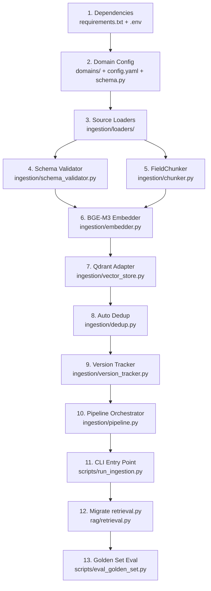

# Kế Hoạch Triển Khai: Tầng 1 – DOMAIN ONBOARDING (Full Architecture)

> **Đã xác nhận:** Qdrant Cloud · BGE-M3 · Multi-domain · PDF/DOCX parser · Migrate hoàn toàn từ ChromaDB (không fallback)

## Mô tả mục tiêu

Triển khai **Tầng 1 – "Domain Onboarding – Nạp dữ liệu & thích nghi domain (Offline / Batch)"** theo đúng kiến trúc infographic với:

- 🗂️ **Multi-domain** từ đầu — mỗi domain có file config YAML riêng
- 📄 **Multi-source parser** — PDF, DOCX, Excel/CSV, Web, API, JSON
- 🔤 **Embedding BGE-M3** — 1024 chiều, multilingual, thay thế MiniLM-L12 (384-dim)
- 🗄️ **Qdrant** thay ChromaDB — mỗi domain một collection riêng
- 🔄 **ETL pipeline** có metadata đầy đủ, schema validation, auto dedup
- 📊 **Golden set** theo từng domain để eval chất lượng retrieval

---

## Trạng thái hiện tại (As-Is)

| Thành phần | As-Is | Target |
|---|---|---|
| Vector DB | ChromaDB (`data/chroma_db`) | **Qdrant** (per-domain collection) |
| Embedding | MiniLM-L12 (384-dim) | **BGE-M3** (1024-dim) |
| Data Source | JSON tĩnh duy nhất | **PDF, DOCX, Excel, Web, JSON, API** |
| ETL | Không có | **LlamaIndex-based parser pipeline** |
| Config | `my_config.py` monolith | **`domains/<id>/config.yaml`** per domain |
| Schema | Hardcode 12 fields | **Pydantic + sinh động theo domain** |
| Dedup | `DUPLICATE_PAIRS` hardcode | **Auto similarity-based dedup** |
| Re-index | Thủ công | **Version-tracked, trigger khi thay đổi** |
| Golden set | Không có | **`domains/<id>/golden_set.json`** |
| Retrieval (`rag/retrieval.py`) | ChromaDB + MiniLM | **Qdrant + BGE-M3** |

---

## User Review Required

> [!CAUTION]
> **Breaking Change: ChromaDB → Qdrant Cloud** ✅ *Đã confirm: migrate hoàn toàn, không giữ fallback.*
> Toàn bộ `rag/retrieval.py` sẽ được viết lại để gọi Qdrant. `data/chroma_db/` sẽ không còn dùng sau migration. **Cần backup thư mục này trước khi chạy `run_ingestion.py --force`.**

> [!CAUTION]
> **Breaking Change: MiniLM (384-dim) → BGE-M3 (1024-dim)**
> Vector dimensions thay đổi → bắt buộc phải **re-index toàn bộ** dữ liệu. BGE-M3 nặng hơn (~570MB), cần đảm bảo RAM ≥ 4GB khi encode.

> [!IMPORTANT]
> **Qdrant Cloud** ✅ *Đã confirm.* Cần cung cấp `QDRANT_URL` và `QDRANT_API_KEY` từ [cloud.qdrant.io](https://cloud.qdrant.io) và thêm vào file `.env` trước khi chạy ingestion.

> [!WARNING]
> **LlamaIndex PDF parser** cần thêm dependency (`pypdf`, `python-docx`, `openpyxl`). Sẽ được thêm vào `requirements.txt`.

---

## Quyết định đã chốt

| Câu hỏi | Quyết định |
|---|---|
| Qdrant deployment | ✅ **Qdrant Cloud** (URL + API key từ cloud.qdrant.io) |
| ChromaDB fallback | ✅ **Không** — migrate hoàn toàn sang Qdrant, xóa bỏ chromadb dependency |

---

## Kiến trúc tổng thể (Target)

```
domains/                                   ← Domain Registry
  administrative_procedures/
    config.yaml                            ← Domain Config (schema, embedding, collection...)
    schema.py                              ← Pydantic schema cho domain
    golden_set.json                        ← Câu hỏi mẫu để eval

ingestion/                                 ← ETL + Parsing Pipeline
  __init__.py
  pipeline.py                              ← Orchestrator chính
  loaders/
    __init__.py
    base_loader.py                         ← Abstract BaseLoader
    json_loader.py                         ← JSON loader (hiện tại)
    pdf_loader.py                          ← PDF → text (LlamaIndex)
    docx_loader.py                         ← DOCX → text (LlamaIndex)
    csv_loader.py                          ← Excel/CSV → records
    web_loader.py                          ← Web scraper (LlamaIndex)
  chunker.py                               ← FieldChunker (per-field)
  dedup.py                                 ← Auto similarity dedup
  embedder.py                              ← BGE-M3 embedding service
  vector_store.py                          ← Qdrant adapter
  version_tracker.py                       ← Hash-based change detection
  schema_validator.py                      ← Pydantic validation

scripts/
  run_ingestion.py                         ← CLI entry point (thay build_index.py)
  eval_golden_set.py                       ← Chạy eval sau ingestion

rag/
  retrieval.py                             ← MODIFY: ChromaDB → Qdrant + BGE-M3
```

---

## Proposed Changes

---

### Component 1 – Dependencies & Cấu hình môi trường

#### [MODIFY] `requirements.txt`

```diff
 gradio
-chromadb
-sentence-transformers
+qdrant-client>=1.9.0
+FlagEmbedding>=1.2.5          # BGE-M3
+llama-index-core>=0.10.0
+llama-index-readers-file>=0.1.0   # PDF, DOCX, CSV readers
+pypdf>=4.0.0                  # PDF backend cho LlamaIndex
+python-docx>=1.1.0            # DOCX parser
+openpyxl>=3.1.0               # Excel reader
+pydantic>=2.0.0               # Schema validation
+pyyaml>=6.0.0                 # Config YAML
+mmh3>=4.0.0                   # MurmurHash cho version tracking
 openai
 python-dotenv
 numpy
 torch
 transformers
 sqlalchemy
 asyncpg
 psycopg2-binary
```

#### [MODIFY] `.env`

Thêm biến môi trường Qdrant Cloud (lấy từ [cloud.qdrant.io](https://cloud.qdrant.io) → Cluster → API Keys):
```bash
# Qdrant Cloud — ✅ đã chốt dùng Cloud
QDRANT_URL=https://xxx.region.gcp.cloud.qdrant.io
QDRANT_API_KEY=your_api_key_here
```

#### [MODIFY] `my_config.py`

```diff
-CHROMA_PATH = BASE_DIR / "data" / "chroma_db"
-COLLECTION_NAME = "procedures"
-EMBEDDING_MODEL = "sentence-transformers/paraphrase-multilingual-MiniLM-L12-v2"
+# Qdrant Cloud config (loaded from .env) — ✅ không fallback ChromaDB
+import os
+QDRANT_URL = os.getenv("QDRANT_URL")          # bắt buộc — lấy từ Qdrant Cloud
+QDRANT_API_KEY = os.getenv("QDRANT_API_KEY")  # bắt buộc
+
+# BGE-M3 embedding model
+EMBEDDING_MODEL = "BAAI/bge-m3"
+EMBEDDING_DIM = 1024
+
+# Default domain
+DEFAULT_DOMAIN = "administrative_procedures"
+DEFAULT_COLLECTION = "administrative_procedures"
```

---

### Component 2 – Domain Config System

Hệ thống config đa domain, mỗi domain một thư mục riêng. Cấu trúc này cho phép thêm domain mới (y tế, du lịch, ẩm thực…) chỉ bằng cách tạo thư mục mới mà không cần sửa code.

#### [NEW] `domains/__init__.py`

```python
from pathlib import Path

DOMAINS_DIR = Path(__file__).parent

def list_domains() -> list[str]:
    return [d.name for d in DOMAINS_DIR.iterdir() if d.is_dir()]
```

#### [NEW] `domains/administrative_procedures/config.yaml`

```yaml
domain_id: administrative_procedures
domain_name: Thủ tục hành chính
description: >
  Tra cứu các thủ tục hành chính công tại TP.HCM.

# --- Embedding ---
embedding_model: BAAI/bge-m3
embedding_dim: 1024

# --- Vector Store ---
collection_name: administrative_procedures
distance_metric: cosine            # Qdrant: Cosine

# --- Chunking ---
chunk_fields:
  - required_documents             # → suffix _docs
  - fee                            # → suffix _fee
  - processing_time                # → suffix _time
  - submission_method              # → suffix _method
  - general                        # → full content

# --- ETL Sources ---
sources:
  - type: json
    path: data/procedures.json
  # Thêm PDF/DOCX sources vào đây khi có:
  # - type: pdf
  #   path: data/raw_docs/
  # - type: web
  #   urls:
  #     - https://dichvucong.gov.vn/...

# --- Policy ---
mode: friendly                     # strict | friendly
persona: thân thiện, giản dị
risk_level: low

# --- Dedup ---
dedup_threshold: 0.95              # Cosine similarity > 0.95 → duplicate
```

#### [NEW] `domains/administrative_procedures/schema.py`

```python
from pydantic import BaseModel, Field
from typing import Optional

class ProcedureDocument(BaseModel):
    """Schema cho domain administrative_procedures."""
    document_id: str
    title: str
    document_type: str = ""
    category: str = ""
    submission_method: Optional[str] = None
    required_documents: Optional[str] = None
    processing_time: Optional[str] = None
    fee: Optional[str] = None
    submission_location: Optional[str] = None
    notes: Optional[str] = None
    source_url: Optional[str] = None
    content: Optional[str] = None
```

#### [NEW] `domains/administrative_procedures/golden_set.json`

```json
[
  {
    "id": "GS_001",
    "question": "Hồ sơ cần chuẩn bị để đăng ký hộ kinh doanh là gì?",
    "expected_proc_id": "PROC_027",
    "expected_chunk_suffix": "_docs",
    "expected_keywords": ["đăng ký kinh doanh", "hộ kinh doanh"]
  },
  {
    "id": "GS_002",
    "question": "Lệ phí đăng ký kết hôn là bao nhiêu?",
    "expected_proc_id": "PROC_001",
    "expected_chunk_suffix": "_fee"
  }
]
```

#### [NEW] `domains/domain_loader.py`

```python
import yaml
from pathlib import Path
from dataclasses import dataclass

@dataclass
class DomainConfig:
    domain_id: str
    domain_name: str
    embedding_model: str
    embedding_dim: int
    collection_name: str
    distance_metric: str
    chunk_fields: list[str]
    sources: list[dict]
    mode: str
    dedup_threshold: float

def load_domain_config(domain_id: str) -> DomainConfig:
    config_path = Path(__file__).parent / domain_id / "config.yaml"
    if not config_path.exists():
        raise FileNotFoundError(f"Domain config not found: {config_path}")
    raw = yaml.safe_load(config_path.read_text(encoding="utf-8"))
    return DomainConfig(**{k: raw[k] for k in DomainConfig.__dataclass_fields__})
```

---

### Component 3 – Source Loaders (ETL / Parsing)

Mỗi file source type có một loader riêng kế thừa `BaseLoader`. LlamaIndex được dùng như parsing engine.

#### [NEW] `ingestion/loaders/base_loader.py`

```python
from abc import ABC, abstractmethod
from dataclasses import dataclass

@dataclass
class RawDocument:
    """Document thô sau khi parse, trước khi validate schema."""
    source_path: str
    raw_text: str
    metadata: dict

class BaseLoader(ABC):
    @abstractmethod
    def load(self, source_config: dict) -> list[RawDocument]:
        """Load documents từ source. Trả về danh sách RawDocument."""
        ...
```

#### [NEW] `ingestion/loaders/json_loader.py`

```python
import json
from pathlib import Path
from .base_loader import BaseLoader, RawDocument

class JSONLoader(BaseLoader):
    """Load structured JSON — format hiện tại của procedures.json."""
    
    def load(self, source_config: dict) -> list[RawDocument]:
        path = Path(source_config["path"])
        records = json.loads(path.read_text(encoding="utf-8"))
        return [
            RawDocument(
                source_path=str(path),
                raw_text="",          # Structured — không cần raw_text
                metadata=rec
            )
            for rec in records
        ]
```

#### [NEW] `ingestion/loaders/pdf_loader.py`

```python
from pathlib import Path
from llama_index.core import SimpleDirectoryReader
from .base_loader import BaseLoader, RawDocument

class PDFLoader(BaseLoader):
    """Parse PDF files using LlamaIndex SimpleDirectoryReader."""
    
    def load(self, source_config: dict) -> list[RawDocument]:
        path = Path(source_config["path"])
        # Load all PDFs in directory or single file
        reader = SimpleDirectoryReader(
            input_dir=str(path) if path.is_dir() else None,
            input_files=[str(path)] if path.is_file() else None,
            required_exts=[".pdf"],
        )
        documents = reader.load_data()
        return [
            RawDocument(
                source_path=doc.metadata.get("file_path", ""),
                raw_text=doc.text,
                metadata={
                    "source_file": doc.metadata.get("file_name", ""),
                    "page_label": doc.metadata.get("page_label", ""),
                }
            )
            for doc in documents
        ]
```

#### [NEW] `ingestion/loaders/docx_loader.py`

```python
from pathlib import Path
from llama_index.core import SimpleDirectoryReader
from .base_loader import BaseLoader, RawDocument

class DOCXLoader(BaseLoader):
    """Parse DOCX files using LlamaIndex."""
    
    def load(self, source_config: dict) -> list[RawDocument]:
        path = Path(source_config["path"])
        reader = SimpleDirectoryReader(
            input_dir=str(path) if path.is_dir() else None,
            input_files=[str(path)] if path.is_file() else None,
            required_exts=[".docx"],
        )
        documents = reader.load_data()
        return [
            RawDocument(
                source_path=doc.metadata.get("file_path", ""),
                raw_text=doc.text,
                metadata={"source_file": doc.metadata.get("file_name", "")},
            )
            for doc in documents
        ]
```

#### [NEW] `ingestion/loaders/csv_loader.py`

```python
import csv
from pathlib import Path
from .base_loader import BaseLoader, RawDocument

class CSVLoader(BaseLoader):
    """Load Excel/CSV — mỗi row là một RawDocument."""
    
    def load(self, source_config: dict) -> list[RawDocument]:
        path = Path(source_config["path"])
        results = []
        with open(path, encoding="utf-8-sig") as f:
            reader = csv.DictReader(f)
            for row in reader:
                results.append(RawDocument(
                    source_path=str(path),
                    raw_text="",
                    metadata=dict(row),
                ))
        return results
```

#### [NEW] `ingestion/loaders/web_loader.py`

```python
from llama_index.readers.web import SimpleWebPageReader
from .base_loader import BaseLoader, RawDocument

class WebLoader(BaseLoader):
    """Scrape web pages using LlamaIndex WebPageReader."""
    
    def load(self, source_config: dict) -> list[RawDocument]:
        urls = source_config.get("urls", [])
        reader = SimpleWebPageReader(html_to_text=True)
        documents = reader.load_data(urls=urls)
        return [
            RawDocument(
                source_path=doc.metadata.get("url", ""),
                raw_text=doc.text,
                metadata={"url": doc.metadata.get("url", "")},
            )
            for doc in documents
        ]
```

#### [NEW] `ingestion/loaders/__init__.py`

```python
from .json_loader import JSONLoader
from .pdf_loader import PDFLoader
from .docx_loader import DOCXLoader
from .csv_loader import CSVLoader
from .web_loader import WebLoader

LOADER_REGISTRY = {
    "json": JSONLoader,
    "pdf": PDFLoader,
    "docx": DOCXLoader,
    "csv": CSVLoader,
    "web": WebLoader,
}

def get_loader(source_type: str):
    loader_cls = LOADER_REGISTRY.get(source_type)
    if not loader_cls:
        raise ValueError(f"Unknown source type: {source_type}")
    return loader_cls()
```

---

### Component 4 – Schema Validator

Validate RawDocument → Typed Schema (Pydantic).

#### [NEW] `ingestion/schema_validator.py`

```python
from pydantic import BaseModel, ValidationError
from typing import Type

def validate_documents(
    raw_docs: list,
    schema_cls: Type[BaseModel],
    domain_id: str,
) -> tuple[list, list]:
    """
    Validate danh sách raw metadata thành Pydantic models.
    Returns: (valid_docs, errors)
    """
    valid, errors = [], []
    for doc in raw_docs:
        data = doc.metadata if hasattr(doc, "metadata") else doc
        try:
            valid.append(schema_cls(**data))
        except ValidationError as e:
            errors.append({"data": data, "error": str(e)})
    
    if errors:
        print(f"[{domain_id}] ⚠️ {len(errors)} documents failed validation")
    return valid, errors
```

---

### Component 5 – FieldChunker

Tách từ `build_index.py` thành module riêng, driven by domain config.

#### [NEW] `ingestion/chunker.py`

```python
from dataclasses import dataclass
from domains.domain_loader import DomainConfig

FIELD_CONFIG = {
    "required_documents": {
        "suffix": "_docs",
        "label": "Thành phần hồ sơ",
        "attr": "required_documents",
    },
    "fee": {
        "suffix": "_fee",
        "label": "Lệ phí",
        "attr": "fee",
    },
    "processing_time": {
        "suffix": "_time",
        "label": "Thời gian giải quyết",
        "attr": "processing_time",
    },
    "submission_method": {
        "suffix": "_method",
        "label": "Hình thức và nơi nộp hồ sơ",
        "attr": "submission_method",
    },
    "general": None,  # Full content — handled separately
}

@dataclass
class Chunk:
    chunk_id: str
    text: str
    metadata: dict

class FieldChunker:
    def __init__(self, config: DomainConfig):
        self.config = config

    def chunk(self, document) -> list[Chunk]:
        """Chunk một document theo các field được cấu hình trong domain config."""
        doc_id = document.document_id
        title = document.title
        base_meta = {
            "document_id": doc_id,
            "title": title,
            "domain": self.config.domain_id,
            "document_type": getattr(document, "document_type", ""),
            "category": getattr(document, "category", ""),
            "source_url": getattr(document, "source_url", "") or "",
        }

        chunks = []
        for field in self.config.chunk_fields:
            if field == "general":
                content = (getattr(document, "content", "") or "").strip()
                if content:
                    chunks.append(Chunk(
                        chunk_id=f"{doc_id}_general",
                        text=content,
                        metadata={**base_meta, "chunk_id": f"{doc_id}_general", "field": "general"},
                    ))
            elif field in FIELD_CONFIG:
                cfg = FIELD_CONFIG[field]
                text = (getattr(document, cfg["attr"], "") or "").strip()
                # submission_method + submission_location kết hợp
                if field == "submission_method":
                    loc = (getattr(document, "submission_location", "") or "").strip()
                    text = "\n".join(filter(None, [text, loc]))
                if text:
                    chunk_id = f"{doc_id}{cfg['suffix']}"
                    chunks.append(Chunk(
                        chunk_id=chunk_id,
                        text=f"Tên thủ tục: {title}\n{cfg['label']}:\n{text}",
                        metadata={**base_meta, "chunk_id": chunk_id, "field": field},
                    ))
        return chunks
```

---

### Component 6 – BGE-M3 Embedder

#### [NEW] `ingestion/embedder.py`

```python
from FlagEmbedding import BGEM3FlagModel
from domains.domain_loader import DomainConfig

class BGEEmbedder:
    """
    BGE-M3 embedding service.
    Singleton per domain — load model once, reuse.
    """
    _instances: dict = {}

    def __init__(self, config: DomainConfig):
        self.config = config
        self._model = None

    def _get_model(self) -> BGEM3FlagModel:
        if self._model is None:
            print(f"[embedder] Loading BGE-M3 model: {self.config.embedding_model}")
            self._model = BGEM3FlagModel(
                self.config.embedding_model,
                use_fp16=True,    # Tiết kiệm VRAM
            )
        return self._model

    def encode(self, texts: list[str]) -> list[list[float]]:
        """Encode texts → dense embeddings (1024-dim)."""
        model = self._get_model()
        output = model.encode(
            texts,
            batch_size=12,
            max_length=512,
            return_dense=True,
            return_sparse=False,
            return_colbert_vecs=False,
        )
        return output["dense_vecs"].tolist()
```

---

### Component 7 – Qdrant Vector Store Adapter

#### [NEW] `ingestion/vector_store.py`

```python
from qdrant_client import QdrantClient
from qdrant_client.models import (
    Distance, VectorParams, PointStruct, Filter,
    FieldCondition, MatchValue,
)
from domains.domain_loader import DomainConfig
import my_config as cfg
import uuid

DISTANCE_MAP = {
    "cosine": Distance.COSINE,
    "dot": Distance.DOT,
    "euclid": Distance.EUCLID,
}

class QdrantVectorStore:
    def __init__(self, config: DomainConfig):
        self.config = config
        self.client = QdrantClient(
            url=cfg.QDRANT_URL,
            api_key=cfg.QDRANT_API_KEY or None,
        )

    def ensure_collection(self) -> None:
        """Tạo collection nếu chưa tồn tại."""
        existing = [c.name for c in self.client.get_collections().collections]
        if self.config.collection_name not in existing:
            self.client.create_collection(
                collection_name=self.config.collection_name,
                vectors_config=VectorParams(
                    size=self.config.embedding_dim,
                    distance=DISTANCE_MAP[self.config.distance_metric],
                ),
            )
            print(f"[qdrant] Created collection: {self.config.collection_name}")

    def upsert(self, chunks: list, embeddings: list[list[float]]) -> int:
        """Upsert chunks + embeddings vào Qdrant."""
        points = [
            PointStruct(
                id=str(uuid.uuid5(uuid.NAMESPACE_DNS, chunk.chunk_id)),
                vector=embedding,
                payload={**chunk.metadata, "text": chunk.text},
            )
            for chunk, embedding in zip(chunks, embeddings)
        ]
        self.client.upsert(
            collection_name=self.config.collection_name,
            points=points,
        )
        return len(points)

    def delete_collection(self) -> None:
        self.client.delete_collection(self.config.collection_name)
        print(f"[qdrant] Deleted collection: {self.config.collection_name}")

    def count(self) -> int:
        return self.client.count(self.config.collection_name).count
```

---

### Component 8 – Auto Dedup

Thay thế `DUPLICATE_PAIRS` hardcode bằng phát hiện tự động qua cosine similarity.

#### [NEW] `ingestion/dedup.py`

```python
import numpy as np
from dataclasses import dataclass

@dataclass
class DedupResult:
    kept: list
    removed: list[dict]   # [{"removed_id": ..., "kept_id": ..., "similarity": ...}]

class SimilarityDeduplicator:
    """
    Phát hiện và loại bỏ document trùng lặp dựa trên cosine similarity.
    Giữ document có content phong phú hơn (nhiều ký tự hơn).
    """
    def __init__(self, threshold: float = 0.95):
        self.threshold = threshold

    def deduplicate(
        self,
        documents: list,
        embeddings: list[list[float]],
    ) -> DedupResult:
        vecs = np.array(embeddings, dtype=np.float32)
        # Normalize
        norms = np.linalg.norm(vecs, axis=1, keepdims=True)
        vecs = vecs / np.maximum(norms, 1e-10)

        n = len(documents)
        removed_ids: set = set()
        removal_log = []

        for i in range(n):
            if documents[i].document_id in removed_ids:
                continue
            for j in range(i + 1, n):
                if documents[j].document_id in removed_ids:
                    continue
                sim = float(np.dot(vecs[i], vecs[j]))
                if sim >= self.threshold:
                    # Giữ document có content dài hơn
                    len_i = len(getattr(documents[i], "content", "") or "")
                    len_j = len(getattr(documents[j], "content", "") or "")
                    if len_i >= len_j:
                        kept, drop = documents[i], documents[j]
                    else:
                        kept, drop = documents[j], documents[i]
                    removed_ids.add(drop.document_id)
                    removal_log.append({
                        "removed_id": drop.document_id,
                        "kept_id": kept.document_id,
                        "similarity": round(sim, 4),
                    })

        kept_docs = [d for d in documents if d.document_id not in removed_ids]
        return DedupResult(kept=kept_docs, removed=removal_log)
```

---

### Component 9 – Version Tracker

#### [NEW] `ingestion/version_tracker.py`

```python
import json
import mmh3
from pathlib import Path
from datetime import datetime

VERSION_FILE = Path("data/.ingestion_versions.json")

class VersionTracker:
    """
    Lưu hash của từng source file để phát hiện thay đổi.
    Chỉ trigger re-index khi nội dung thực sự thay đổi.
    """
    def __init__(self):
        self._data = self._load()

    def _load(self) -> dict:
        if VERSION_FILE.exists():
            return json.loads(VERSION_FILE.read_text())
        return {}

    def _save(self) -> None:
        VERSION_FILE.parent.mkdir(parents=True, exist_ok=True)
        VERSION_FILE.write_text(json.dumps(self._data, indent=2, ensure_ascii=False))

    def _hash_file(self, path: Path) -> str:
        content = path.read_bytes()
        return str(mmh3.hash128(content))

    def has_changed(self, path: Path) -> bool:
        key = str(path)
        current_hash = self._hash_file(path)
        return self._data.get(key, {}).get("hash") != current_hash

    def mark_indexed(self, path: Path) -> None:
        key = str(path)
        self._data[key] = {
            "hash": self._hash_file(path),
            "indexed_at": datetime.now().isoformat(),
        }
        self._save()
```

---

### Component 10 – Ingestion Pipeline Orchestrator

#### [NEW] `ingestion/pipeline.py`

```python
from dataclasses import dataclass
from domains.domain_loader import DomainConfig, load_domain_config
from ingestion.loaders import get_loader
from ingestion.schema_validator import validate_documents
from ingestion.chunker import FieldChunker
from ingestion.embedder import BGEEmbedder
from ingestion.dedup import SimilarityDeduplicator
from ingestion.vector_store import QdrantVectorStore
from ingestion.version_tracker import VersionTracker
from pathlib import Path
import importlib

@dataclass
class IngestionResult:
    domain_id: str
    total_loaded: int
    total_valid: int
    total_after_dedup: int
    total_chunks: int
    removed_duplicates: list[dict]
    validation_errors: list[dict]

class IngestionPipeline:
    """
    Orchestrator chính của Tầng 1.
    
    Flow:
    1. Load domain config
    2. Khởi tạo các service
    3. Load sources → RawDocuments
    4. Validate schema
    5. (Optional) Auto dedup
    6. Chunk per-field
    7. Embed with BGE-M3
    8. Upsert to Qdrant
    """

    def __init__(self, domain_id: str):
        self.domain_id = domain_id
        self.config = load_domain_config(domain_id)
        self.chunker = FieldChunker(self.config)
        self.embedder = BGEEmbedder(self.config)
        self.store = QdrantVectorStore(self.config)
        self.deduplicator = SimilarityDeduplicator(self.config.dedup_threshold)
        self.tracker = VersionTracker()

    def _load_schema(self):
        """Import schema class từ domain package."""
        module = importlib.import_module(
            f"domains.{self.domain_id}.schema"
        )
        # Convention: tên class = ProcedureDocument hoặc class đầu tiên là BaseModel
        for name in dir(module):
            obj = getattr(module, name)
            if isinstance(obj, type) and hasattr(obj, "model_fields"):
                return obj
        raise ImportError(f"No Pydantic schema found in domains/{self.domain_id}/schema.py")

    def run(self, force_reindex: bool = False) -> IngestionResult:
        schema_cls = self._load_schema()
        
        # ---- 1. Ensure Qdrant collection ----
        if force_reindex:
            self.store.delete_collection()
        self.store.ensure_collection()

        # ---- 2. Load all sources ----
        all_raw = []
        for source_cfg in self.config.sources:
            loader = get_loader(source_cfg["type"])
            raw_docs = loader.load(source_cfg)
            all_raw.extend(raw_docs)
            print(f"[pipeline] Loaded {len(raw_docs)} docs from {source_cfg['type']}:{source_cfg.get('path','')}")

        # ---- 3. Validate ----
        valid_docs, val_errors = validate_documents(all_raw, schema_cls, self.domain_id)
        print(f"[pipeline] Valid: {len(valid_docs)} / {len(all_raw)}")

        # ---- 4. Dedup using _general text as representative embedding ----
        print("[pipeline] Computing dedup embeddings...")
        general_texts = [
            (getattr(d, "content", "") or d.title or "")
            for d in valid_docs
        ]
        general_embeddings = self.embedder.encode(general_texts)
        dedup_result = self.deduplicator.deduplicate(valid_docs, general_embeddings)
        print(f"[pipeline] Dedup: removed {len(dedup_result.removed)} duplicates")

        # ---- 5. Chunk ----
        all_chunks = []
        for doc in dedup_result.kept:
            all_chunks.extend(self.chunker.chunk(doc))
        print(f"[pipeline] Total chunks: {len(all_chunks)}")

        # ---- 6. Embed chunks ----
        print("[pipeline] Embedding chunks with BGE-M3...")
        chunk_texts = [c.text for c in all_chunks]
        chunk_embeddings = self.embedder.encode(chunk_texts)

        # ---- 7. Upsert to Qdrant ----
        count = self.store.upsert(all_chunks, chunk_embeddings)
        print(f"[pipeline] Upserted {count} points to Qdrant collection '{self.config.collection_name}'")

        return IngestionResult(
            domain_id=self.domain_id,
            total_loaded=len(all_raw),
            total_valid=len(valid_docs),
            total_after_dedup=len(dedup_result.kept),
            total_chunks=count,
            removed_duplicates=dedup_result.removed,
            validation_errors=val_errors,
        )
```

---

### Component 11 – CLI Entry Point

#### [NEW] `scripts/run_ingestion.py`

```python
"""
run_ingestion.py — CLI entry point cho Ingestion Pipeline.

Usage:
    python scripts/run_ingestion.py --domain administrative_procedures
    python scripts/run_ingestion.py --domain administrative_procedures --force
    python scripts/run_ingestion.py --list-domains
"""
import argparse
import sys
from pathlib import Path

sys.path.insert(0, str(Path(__file__).parent.parent))

from ingestion.pipeline import IngestionPipeline
from domains import list_domains

def main():
    parser = argparse.ArgumentParser(description="Domain Onboarding CLI")
    parser.add_argument("--domain", type=str, help="Domain ID to ingest")
    parser.add_argument("--force", action="store_true", help="Force full re-index")
    parser.add_argument("--list-domains", action="store_true", help="List available domains")
    args = parser.parse_args()

    if args.list_domains:
        print("Available domains:", list_domains())
        return

    if not args.domain:
        parser.print_help()
        return

    print(f"{'='*60}")
    print(f"DOMAIN ONBOARDING: {args.domain}")
    print(f"{'='*60}")

    pipeline = IngestionPipeline(domain_id=args.domain)
    result = pipeline.run(force_reindex=args.force)

    print(f"\n{'='*60}")
    print(f"HOÀN THÀNH — {result.domain_id}")
    print(f"{'='*60}")
    print(f"Loaded        : {result.total_loaded}")
    print(f"Valid         : {result.total_valid}")
    print(f"After dedup   : {result.total_after_dedup}")
    print(f"Total chunks  : {result.total_chunks}")
    print(f"Duplicates    : {len(result.removed_duplicates)}")
    print(f"Val errors    : {len(result.validation_errors)}")

if __name__ == "__main__":
    main()
```

---

### Component 12 – Migrate `rag/retrieval.py` sang Qdrant Cloud + BGE-M3

Đây là thay đổi **breaking** quan trọng nhất — toàn bộ search runtime. **Không giữ ChromaDB fallback.**

#### [MODIFY] `rag/retrieval.py`

```diff
-import chromadb
-from sentence_transformers import SentenceTransformer
+from qdrant_client import QdrantClient
+from qdrant_client.models import ScoredPoint
+from FlagEmbedding import BGEM3FlagModel
 import my_config as cfg

-_embedding_model: SentenceTransformer | None = None
-_chroma_collection = None
+_embedding_model: BGEM3FlagModel | None = None
+_qdrant_client: QdrantClient | None = None   # Kết nối Qdrant Cloud

-def load_embedding_model() -> SentenceTransformer:
-    return SentenceTransformer(cfg.EMBEDDING_MODEL)
+def load_embedding_model() -> BGEM3FlagModel:
+    return BGEM3FlagModel(cfg.EMBEDDING_MODEL, use_fp16=True)

-def load_vector_store():
-    client = chromadb.PersistentClient(path=str(cfg.CHROMA_PATH))
-    return client.get_collection(name=cfg.COLLECTION_NAME)
+def load_vector_store() -> QdrantClient:
+    # Qdrant Cloud — URL và API key bắt buộc từ .env
+    if not cfg.QDRANT_URL:
+        raise RuntimeError("QDRANT_URL chưa được set trong .env")
+    return QdrantClient(url=cfg.QDRANT_URL, api_key=cfg.QDRANT_API_KEY)

 def retrieve(query, context=None, top_k=cfg.DEFAULT_TOP_K):
     model = _get_embedding_model()
-    query_embedding = model.encode(query, normalize_embeddings=True).tolist()
-    results = collection.query(query_embeddings=[query_embedding], n_results=candidate_count)
+    output = model.encode([query], return_dense=True, return_sparse=False, return_colbert_vecs=False)
+    query_embedding = output["dense_vecs"][0].tolist()
+    # Tìm kiếm trên Qdrant Cloud
+    hits: list[ScoredPoint] = client.search(
+        collection_name=cfg.DEFAULT_COLLECTION,
+        query_vector=query_embedding,
+        limit=candidate_count,
+        with_payload=True,
+    )
+    # Map ScoredPoint.payload → RetrievedChunk (giữ nguyên interface)
```

**Strategy:**
- Giữ nguyên **interface** `retrieve()` và `retrieve_two_step()` — consumer không sửa
- `rag/pipeline.py`, `rag/synthesizer.py`, `rag/procedure_reader.py`… không cần đụng
- `chromadb` được **xóa khỏi** `requirements.txt` và `retrieval.py`

---

### Component 13 – Golden Set Evaluator

#### [NEW] `scripts/eval_golden_set.py`

```python
"""
Chạy golden set evaluation để đo chất lượng retrieval sau khi index.

Usage:
    python scripts/eval_golden_set.py --domain administrative_procedures
"""
import json, sys, argparse
from pathlib import Path

sys.path.insert(0, str(Path(__file__).parent.parent))

def main():
    parser = argparse.ArgumentParser()
    parser.add_argument("--domain", required=True)
    args = parser.parse_args()

    golden_path = Path(f"domains/{args.domain}/golden_set.json")
    questions = json.loads(golden_path.read_text(encoding="utf-8"))

    from rag.retrieval import retrieve
    hits, total = 0, len(questions)

    for q in questions:
        results = retrieve(q["question"], top_k=5)
        retrieved_ids = [r.document_id for r in results]
        hit = q["expected_proc_id"] in retrieved_ids
        hits += int(hit)
        status = "✓" if hit else "✗"
        print(f"  {status} [{q['id']}] {q['question'][:50]}")
        if not hit:
            print(f"     Expected: {q['expected_proc_id']}, Got: {retrieved_ids[:3]}")

    print(f"\nRetrieval@5: {hits}/{total} = {hits/total*100:.1f}%")

if __name__ == "__main__":
    main()
```

---

## Thứ tự triển khai



---

## Tổng hợp files

| File | Action | Component |
|---|---|---|
| `requirements.txt` | MODIFY | 1 |
| `.env` | MODIFY | 1 |
| `my_config.py` | MODIFY | 1 |
| `domains/__init__.py` | **NEW** | 2 |
| `domains/domain_loader.py` | **NEW** | 2 |
| `domains/administrative_procedures/config.yaml` | **NEW** | 2 |
| `domains/administrative_procedures/schema.py` | **NEW** | 2 |
| `domains/administrative_procedures/golden_set.json` | **NEW** | 2 |
| `ingestion/__init__.py` | **NEW** | 3 |
| `ingestion/loaders/__init__.py` | **NEW** | 3 |
| `ingestion/loaders/base_loader.py` | **NEW** | 3 |
| `ingestion/loaders/json_loader.py` | **NEW** | 3 |
| `ingestion/loaders/pdf_loader.py` | **NEW** | 3 |
| `ingestion/loaders/docx_loader.py` | **NEW** | 3 |
| `ingestion/loaders/csv_loader.py` | **NEW** | 3 |
| `ingestion/loaders/web_loader.py` | **NEW** | 3 |
| `ingestion/schema_validator.py` | **NEW** | 4 |
| `ingestion/chunker.py` | **NEW** | 5 |
| `ingestion/embedder.py` | **NEW** | 6 |
| `ingestion/vector_store.py` | **NEW** | 7 |
| `ingestion/dedup.py` | **NEW** | 8 |
| `ingestion/version_tracker.py` | **NEW** | 9 |
| `ingestion/pipeline.py` | **NEW** | 10 |
| `scripts/run_ingestion.py` | **NEW** | 11 |
| `scripts/build_index.py` | ⚠️ Deprecated (giữ lại để reference) | — |
| `rag/retrieval.py` | MODIFY | 12 |
| `scripts/eval_golden_set.py` | **NEW** | 13 |

**Tổng: 14 files NEW, 4 files MODIFY**

---

## Verification Plan

### Automated Tests

```bash
# 1. Cài dependencies mới
pip install -r requirements.txt

# 2. Chạy ingestion pipeline (force re-index)
python scripts/run_ingestion.py --domain administrative_procedures --force

# 3. Kiểm tra Qdrant collection
python -c "
from qdrant_client import QdrantClient
import os
client = QdrantClient(url=os.getenv('QDRANT_URL', 'http://localhost:6333'))
info = client.get_collection('administrative_procedures')
print('Points count:', info.points_count)
print('Vector size:', info.config.params.vectors.size)
"

# 4. Chạy golden set eval
python scripts/eval_golden_set.py --domain administrative_procedures

# 5. Smoke test chat pipeline
python -c "
from rag.pipeline import answer_query
result = answer_query('Hồ sơ đăng ký kết hôn cần những gì?')
print(result.answer[:200])
"
```

### Manual Verification

1. **Qdrant Collection:**
   - [ ] Collection `administrative_procedures` tồn tại
   - [ ] Vector dimension = 1024 (BGE-M3)
   - [ ] Points count ≥ chunks từ `build_index.py` cũ

2. **Dedup:**
   - [ ] Log cho thấy các cặp duplicate cũ (PROC_008, PROC_010…) bị loại bỏ

3. **Retrieval Quality:**
   - [ ] `eval_golden_set.py` đạt Retrieval@5 ≥ 80%

4. **Backward Compatibility:**
   - [ ] Backend chat (`backend/main.py`) vẫn khởi động bình thường
   - [ ] WebSocket `/ws/chat` vẫn trả lời đúng câu hỏi đơn giản

5. **Multi-domain extensibility:**
   - [ ] Thêm domain mới chỉ cần tạo `domains/<new_domain>/` mà không sửa code
